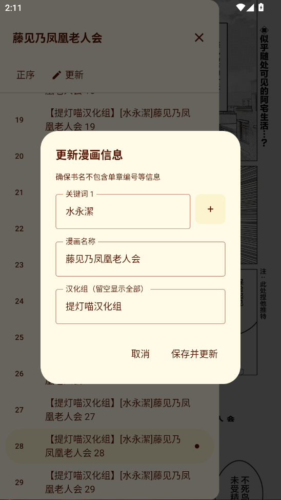
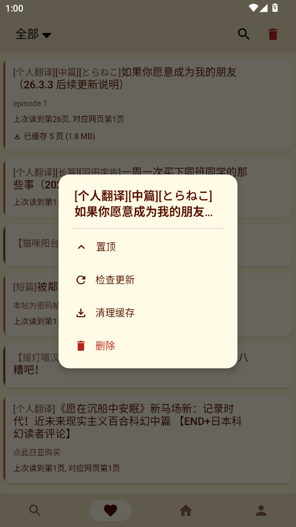
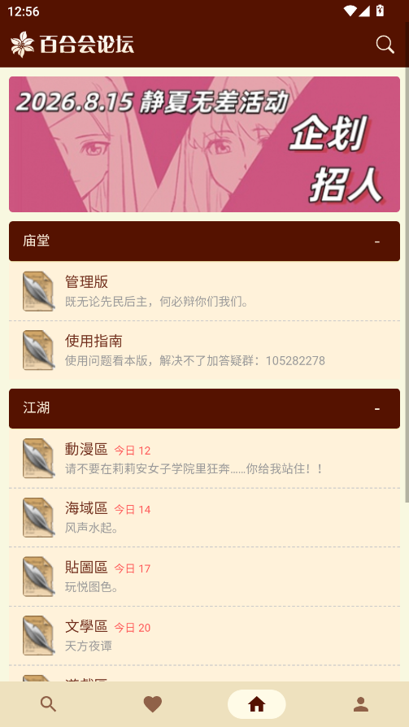
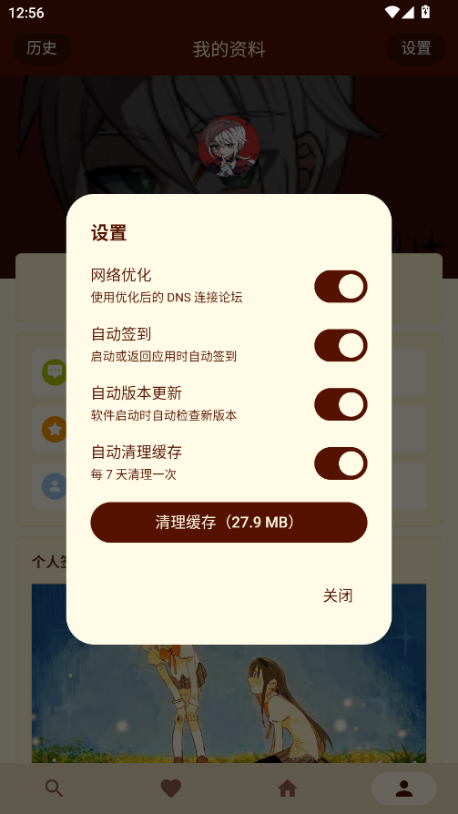
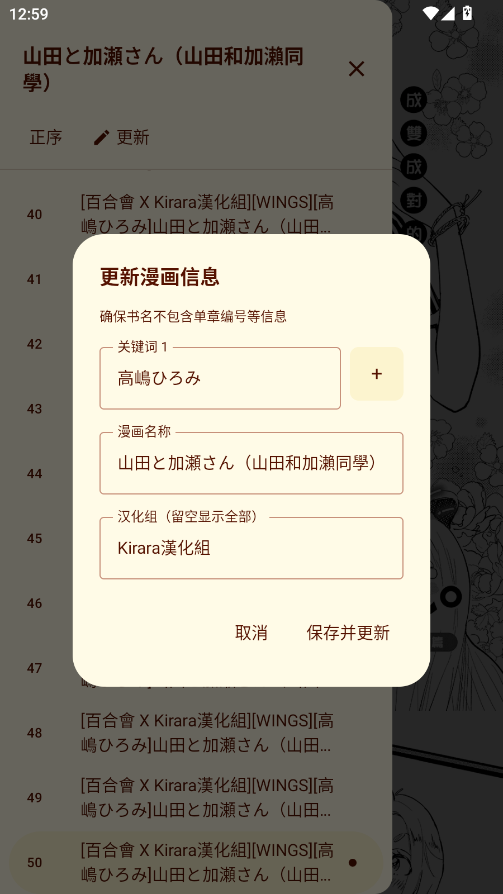
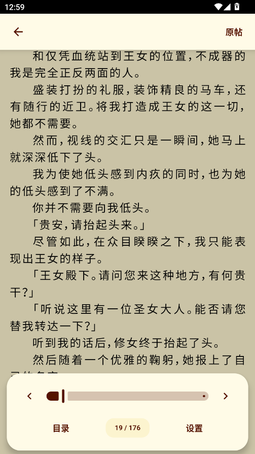
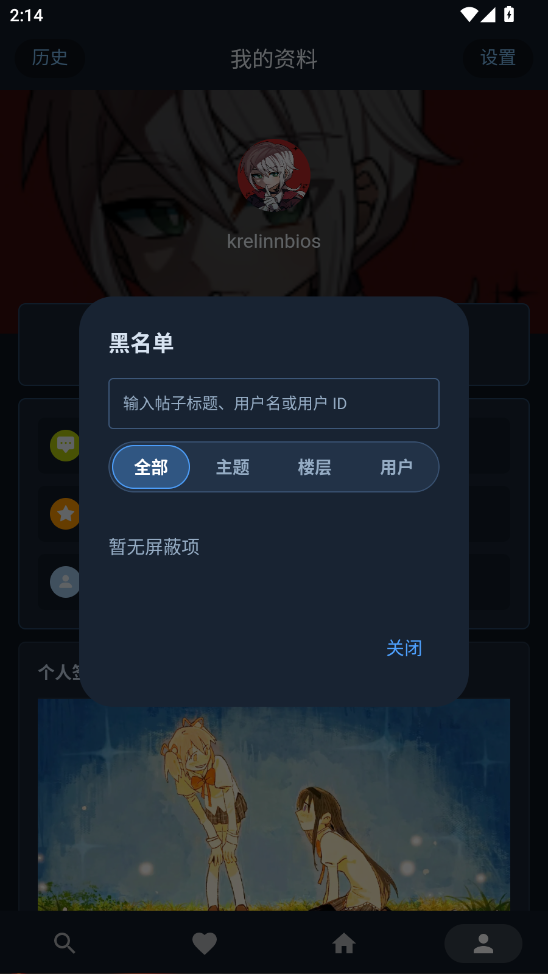

# YamiboReaderLite

  

  <strong>300 Lite</strong> 
  面向百合会论坛的非官方 Android 阅读客户端

> [!IMPORTANT]
> YamiboReaderLite 基于 [prprbell/YamiboReaderPro](https://github.com/prprbell/YamiboReaderPro) 修改和继续开发，并非从零开发的独立项目。感谢原作者及所有上游贡献者。

## 项目简介

YamiboReaderLite 是面向百合会论坛的非官方 Android 阅读客户端。当前 Lite 版本将论坛浏览、收藏管理、浏览历史、小说阅读和漫画阅读整合在同一个应用中，并在界面、功能和行为上做了持续调整。

以下说明仅描述 YamiboReaderLite 当前实际提供的功能。

## 功能概览

### 浏览 / 阅读

- 论坛浏览：登录账号浏览百合会论坛，支持自动签到、DNS 网络优化和简繁切换。
- 漫画发现：浏览和搜索中文漫画区、漫画图源区，整理并更新漫画目录。
- 漫画阅读：支持章节切换、进度记录、图片缓存、亮度调节和三种阅读方向，识别失败时用网页兜底。
- 小说阅读：支持字号、行距、页边距、翻页方式、正文图片、简繁转换、进度记录和页面缓存；提供跨论坛页聚合的全书章节目录，可按序号或章节号搜索并正倒序排列。

### 内容管理

- 收藏管理：同步论坛收藏，支持分类、搜索、置顶、隐藏、删除、手动或下拉批量更新检查和缓存清理。
- 浏览历史：记录浏览历史，支持日期筛选、组合搜索和删除。
- 链接直达：复制百合会帖子链接后回到应用即可一键打开，也支持从其他应用直接用本应用打开帖子链接。

### 辅助设置

- 论坛屏蔽：屏蔽指定主题、楼层或用户，黑名单支持搜索与筛选。
- 暗黑模式：经典蓝黑配色，原生界面与论坛网页同步切换深色。
- 语言切换：支持简体中文与繁體中文切换，同步更新原生界面和论坛显示语言。
- 缓存维护：维护小说页面与漫画图片缓存，支持定期清理。
- 应用更新：通过 GitHub Releases 检查新版本，支持下载、校验 APK、调起系统安装器。

### 体验相关

- 新手引导：登录后首次进入漫画发现、漫画阅读、收藏管理或小说阅读时，弹出一次性的基本操作提示。
- 底栏交互：下拉刷新当前页面；点击底栏图标切换到对应板块，长按则直接回到板块主页。
- 崩溃兜底：拦截后台线程异常以减少闪退，并记录崩溃日志便于排查问题。

## 界面预览

  
  
  
  
  

  
  
  
  
  

## 使用方式

### 安装使用

从 [Releases](https://github.com/KrelinnBios/YamiboReaderLite/releases) 下载 APK 后安装。

### 系统要求

Android 7.0（API 24）及以上。

当前 APK 仅构建 ARM 架构：`arm64-v8a` 和 `armeabi-v7a`。

### 更新方式

应用启动时会通过 GitHub Releases API 检查新版本，也可以在设置页手动检查更新。检测到更新后可以在应用内下载并调起系统安装器；如果自动下载或安装器启动失败，应用会提供 Releases 手动下载入口。

应用会校验下载到的 APK 版本与签名。若当前安装包与 Releases 包签名不一致，系统安装器会拒绝覆盖安装，需要先卸载旧包后再从 Releases 安装。

## 技术信息

- 技术栈：Kotlin、Jetpack Compose、Android WebView、Retrofit、OkHttp。
- 更新机制：通过 GitHub Releases API 检查版本，并对下载到的 APK 做版本与签名校验。
- 上游来源：[prprbell/YamiboReaderPro](https://github.com/prprbell/YamiboReaderPro)。

## 内容边界

- 本项目为非官方客户端，与百合会论坛运营方无隶属关系。
- 请遵守目标论坛规则、版权要求以及所在地法律法规。
- 本项目基于上游项目继续开发，相关来源与许可证信息请同时参考本仓库的 [LICENSE](./LICENSE) 和 [NOTICE](./NOTICE)。

## 许可协议

本项目依据 [GNU AGPL-3.0](./LICENSE) 发布。

相关项目：

- [prprbell/YamiboReaderPro](https://github.com/prprbell/YamiboReaderPro)
- [flben233/YamiboReader](https://github.com/flben233/YamiboReader)
- [duck123ducker/yamibo_manga_reader](https://github.com/duck123ducker/yamibo_manga_reader)（参考）

## 反馈与贡献

欢迎通过 [GitHub Issue](https://github.com/KrelinnBios/YamiboReaderLite/issues) 提交使用问题、兼容性问题、功能建议或其他改进建议。
