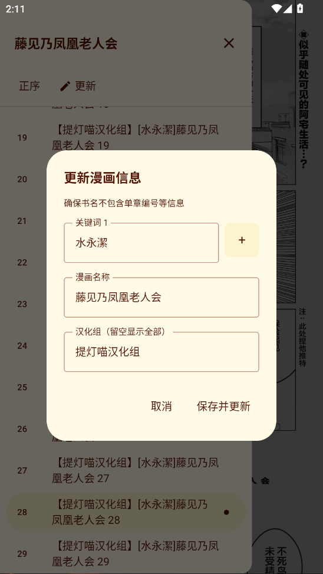
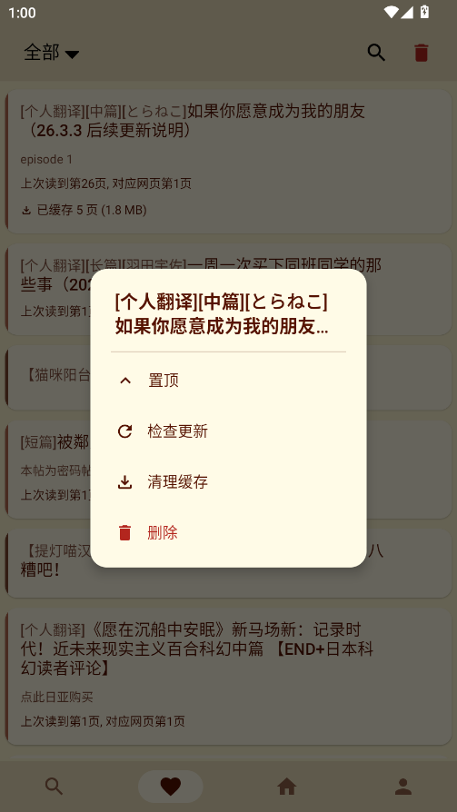
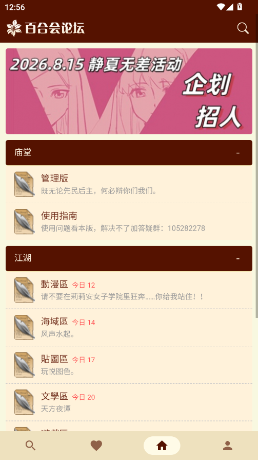
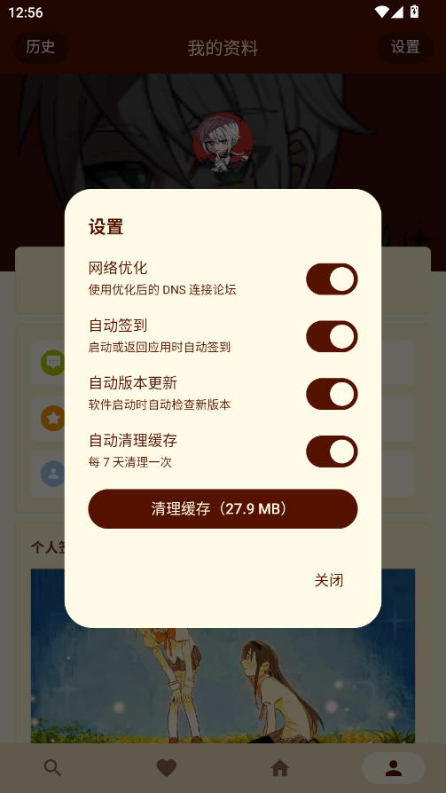
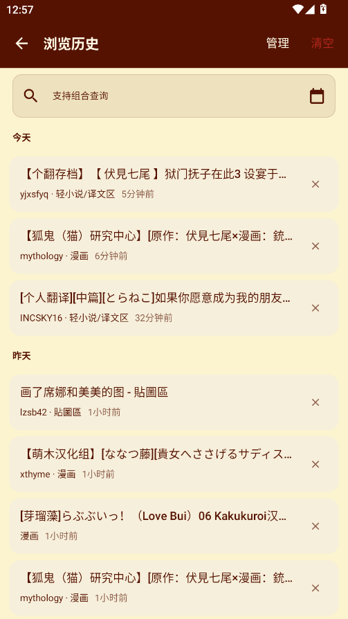
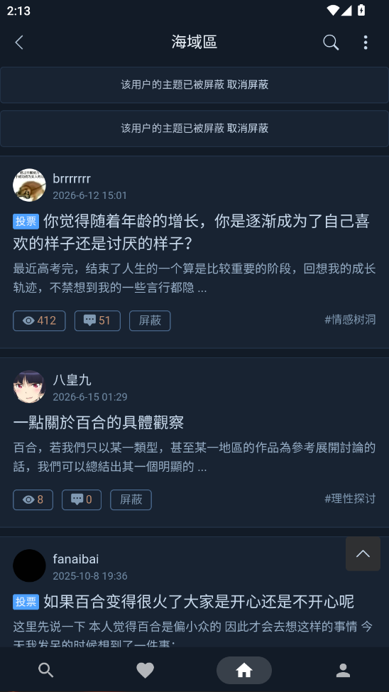
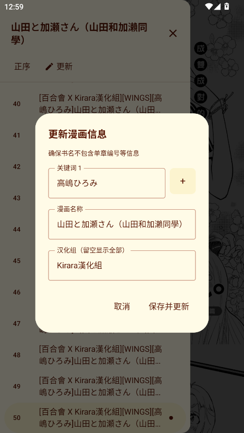
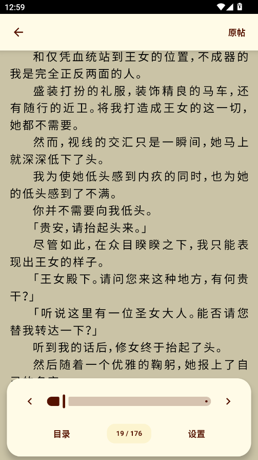
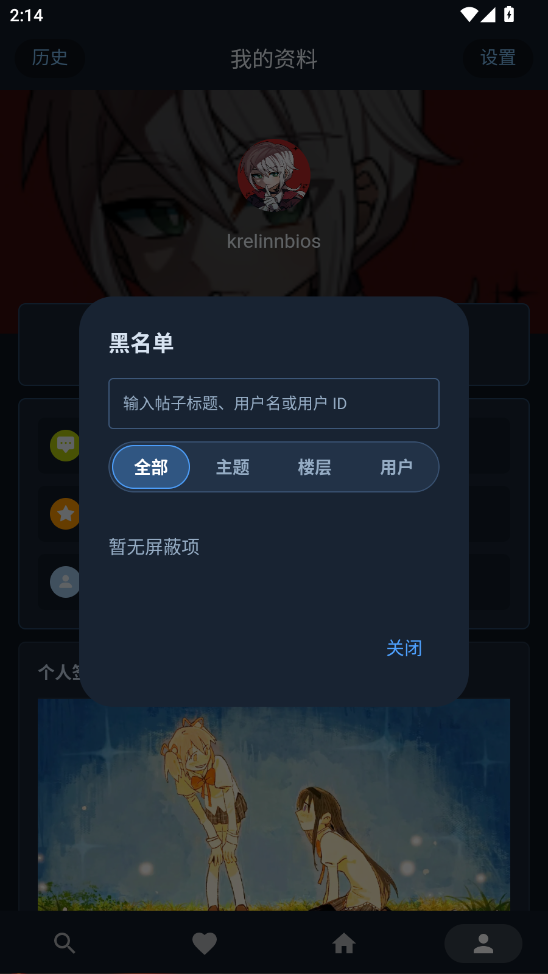

# YamiboReaderLite

  

  <strong>300 Lite</strong> 
  面向百合会论坛的非官方 Android 阅读客户端

  
  
  

> [!IMPORTANT]
> YamiboReaderLite 基于 [prprbell/YamiboReaderPro](https://github.com/prprbell/YamiboReaderPro) 修改和继续开发，同时延续 [flben233/YamiboReader](https://github.com/flben233/YamiboReader) 的上游代码，并非从零开发的独立项目。完整上游归属见 [NOTICE](./NOTICE)。感谢原作者及所有上游贡献者。

## 项目简介

YamiboReaderLite 是面向百合会论坛的非官方 Android 阅读客户端。Lite 版本围绕移动端阅读体验，整合论坛浏览、收藏管理、浏览历史、小说阅读和漫画阅读等功能。以下说明仅描述 YamiboReaderLite 当前实际提供的功能。

## 功能概览

- 论坛浏览：登录账号浏览百合会论坛，支持自动签到、深色显示、简繁切换和 DNS 优化。
- 链接直达：识别剪贴板及其他应用传入的百合会帖子链接，并直接打开对应帖子。
- 论坛屏蔽：屏蔽指定主题、楼层或用户，支持搜索、筛选、解除屏蔽及论坛黑名单同步。
- 漫画发现：浏览和搜索中文漫画区、漫画图源区，生成、更新和管理本地漫画目录。
- 漫画阅读：支持章节切换、进度记录、图片缓存、缩放和亮度调节，以及纵向、从左到右、从右到左三种阅读方向；原生识别失败时使用网页阅读兜底。
- 小说阅读：支持字号、行距、页边距、横向或纵向翻页、正文图片、简繁转换、进度记录和页面缓存。
- 章节目录：自动识别并后台补全跨论坛页的小说目录，支持正倒序浏览、章节搜索和跨页跳转。
- 收藏管理：同步论坛收藏，支持分类、搜索、拖动排序、置顶、批量隐藏或删除和单项缓存清理。
- 更新提醒：分别检查小说、漫画和其他帖子的新内容，标记更新状态并提示新同步的收藏。
- 浏览历史：记录浏览过的帖子，支持日期筛选、组合搜索、批量删除和独立页面打开。
- 缓存维护：统计并清理小说页面与漫画图片缓存，支持单项、全部和定期自动清理。
- 数据备份：导出和导入收藏排序、漫画目录、阅读进度、浏览历史、黑名单及全部设置。
- 应用更新：启动或手动检查 GitHub Releases，支持下载、校验 APK 并调用系统安装器。
- 新手引导：首次进入主要原生页面或使用底栏时，显示对应的基本操作提示。
- 应用设置：集中管理主题、语言、网络、缓存、备份、更新和问题反馈。

## 界面预览

  
  
  
  
  

  
  
  
  
  

## 使用方式

### 安装使用

从 [Releases](https://github.com/KrelinnBios/YamiboReaderLite/releases) 下载 `300 Lite.apk` 后安装。

### 系统要求

Android 7.0（API 24）及以上。

当前 APK 仅提供 `arm64-v8a` 和 `armeabi-v7a` 架构版本。

### 更新方式

应用可在启动时或设置页检查新版本。检测到更新后，可在应用内下载并安装，也可以前往 Releases 页面手动下载。

若系统提示无法覆盖安装，通常需要先卸载旧版，再从 Releases 重新安装。

## 数据与安全

- 登录状态、收藏、历史、阅读进度和缓存等数据保存在设备本地或来自百合会论坛账号本身。
- 请只从本仓库 Releases 或可信来源安装 APK，避免使用来源不明的改包版本。
- 清理应用数据、卸载应用或更换设备可能导致本地历史、缓存和设置丢失。

## 内容边界

- 本项目为非官方客户端，与百合会论坛运营方无隶属关系。
- 请遵守目标论坛规则、版权要求以及所在地法律法规。
- 论坛内容、图片和用户发表的信息来自原站点或相应内容发布者，分别适用论坛规则及相关权利人的权利声明。
- 本项目基于上游项目继续开发，相关来源与许可证信息请同时参考本仓库的 [LICENSE](./LICENSE) 和 [NOTICE](./NOTICE)。

## 许可协议

本项目依据 [GNU AGPL-3.0](./LICENSE) 发布。上游代码归属及本项目修改说明见 [NOTICE](./NOTICE)。

第三方软件、内容和外部服务不因被本项目引用、访问、编译或展示而自动纳入 AGPL-3.0，具体见 [THIRD-PARTY-NOTICES.md](./THIRD-PARTY-NOTICES.md)。

相关项目：

- [prprbell/YamiboReaderPro](https://github.com/prprbell/YamiboReaderPro)
- [flben233/YamiboReader](https://github.com/flben233/YamiboReader)
- [duck123ducker/yamibo_manga_reader](https://github.com/duck123ducker/yamibo_manga_reader)（参考）
- [belleangelina/300X](https://github.com/belleangelina/300X)（Flutter 跨平台客户端）
- [TnZzZHlp/Pocket300](https://github.com/TnZzZHlp/Pocket300)（Android 客户端）
- [QAQadws/y300](https://github.com/QAQadws/y300)（Android 客户端）
- [LittleSurvival/yamibo-app](https://github.com/LittleSurvival/yamibo-app)（Android 客户端）
- [Arkalin/YamiboX](https://github.com/Arkalin/YamiboX)（SwiftUI iOS 客户端）

## 反馈与贡献

欢迎通过 [GitHub Issue](https://github.com/KrelinnBios/YamiboReaderLite/issues) 提交使用问题、兼容性问题、功能建议或其他改进建议。
